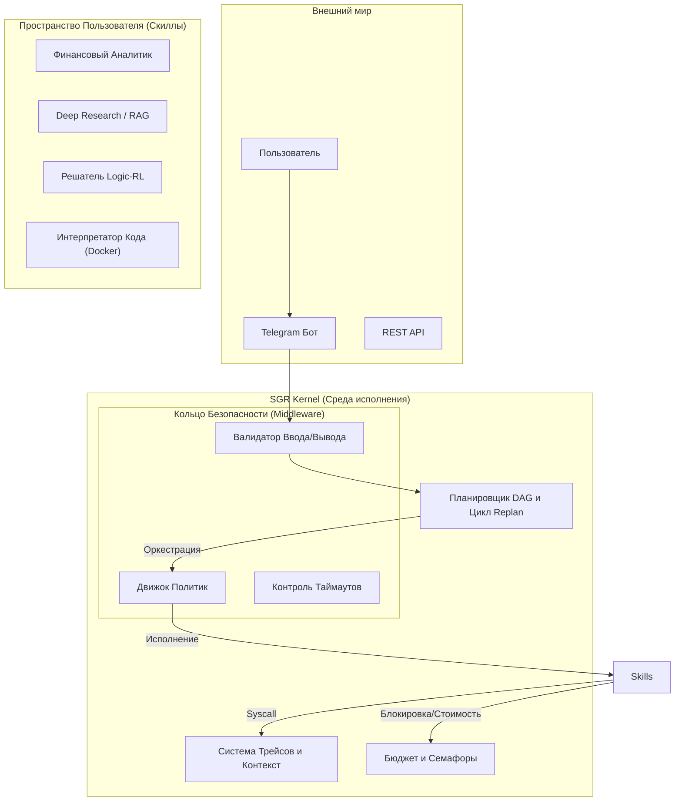

# SGR Kernel (Schema-Guided Reasoning Kernel)

**Операционная система корпоративного уровня для автономных AI-агентов.**

   

---

## 🚀 Обзор

**SGR Kernel** — это не просто фреймворк для агентов. Это полноценная **среда исполнения (Runtime Environment)**, которая управляет большими языковыми моделями (LLM) так же строго, как операционная система управляет процессами.

Ядро абстрагирует взаимодействие с LLM, векторными базами данных и Docker-контейнерами, предоставляя стабильный, безопасный и наблюдаемый фундамент для создания сложных приложений рассуждения ("Скиллов").

**Ключевая философия:**
*   **Kernel vs. User Space**: Ядро занимается планированием, безопасностью и памятью. Скиллы реализуют бизнес-логику.
*   **Глубокая защита (Defense in Depth)**: Каждое выполнение скилла проходит через строгое "Кольцо Безопасности" (Middleware Ring) — проверки политик, таймаутов, утверждений.
*   **Устойчивость к сбоям**: Падение отдельного скилла не обрушивает агента. Ядро перехватывает исключения, контролирует бюджет и запускает циклы перепланирования (Self-Healing).

---

## 🏗️ Архитектура



---

## 🛡️ Сервисы Ядра

### 1. Управление Процессами (Scheduler)
*   **DAG Execution**: Поддержка сложных графов зависимостей, а не только линейных цепочек.
*   **Replan Loop**: Автоматическое обнаружение сбоев выполнения и запуск локализованного перепланирования.
*   **Concurrency Guard (R7)**: Семафоры предотвращают исчерпание ресурсов, ограничивая параллельный запуск тяжелых скиллов.

### 2. Память и Наблюдаемость
*   **Атомарные Трейсы**: Каждое изменение состояния записывается в структурированный `RequestTrace`.
*   **Step Replay**: Полная история выполнения позволяет детерминировано воспроизводить и отлаживать сценарии.
*   **Plan Hashing (F4)**: Обнаружение дрейфа между исходным планом и реальностью выполнения.

### 3. Кольцо Безопасности (Middleware)
*   **Policy Engine**: Ролевой контроль доступа (RBAC) для разрешения/запрета скиллов на основе контекста пользователя.
*   **Timeout Authority (F1)**: Строгое соблюдение лимитов времени выполнения согласно метаданным скилла.
*   **Инварианты**: Проверки времени выполнения (Runtime Checks), гарантирующие, что ключевые свойства системы никогда не нарушаются.

### 4. Управление Ресурсами
*   **Бюджетирование (R3)**: Учет использования токенов и стоимости выполнения для каждой попытки.
*   **Санитизация**: Автоматическое удаление чувствительных данных из логов и вывода.

---

## 📦 Предустановленные Возможности (Скиллы)

Ядро поставляется с мощным набором встроенных скиллов:

1.  **Logic-RL**: Движок рассуждений, решающий сложные логические задачи путем итеративного написания и проверки кода Python в песочнице.
2.  **RLM (Recursive Reader)**: Анализирует массивные документы, рекурсивно разбивая их на части и суммируя секции.
3.  **Deep Research**: Автономный веб-серфинг и синтез информации.
4.  **Office Automation**: Генерация отчетов `.docx` и презентаций `.pptx`.

---

## 🚀 Начало Работы

### Требования
*   Docker & Docker Compose
*   Python 3.11+

### Быстрый Старт

1.  **Настройка окружения**:
    ```bash
    cp .env.example .env
    # Установите OPENAI_API_KEY, GROQ_API_KEY и другие переменные
    ```

2.  **Запуск Ядра**:
    ```bash
    docker-compose up -d --build
    ```
    *   **UI**: http://localhost:8501
    *   **Vector DB**: localhost:6343

3.  **Запуск Тестов (Верификация)**:
    ```bash
    python -m pytest tests/kernel/test_hardening_r7.py
    ```

---

## 📚 Документация
*   [KERNEL_SPEC.md](KERNEL_SPEC.md): Строгая архитектурная спецификация.
*   [SKILL_DEVELOPMENT.md](SKILL_DEVELOPMENT.md): Руководство по созданию новых модулей ядра.

---

**Статус**: Hardened Release (R7). Протестировано для промышленной эксплуатации.
