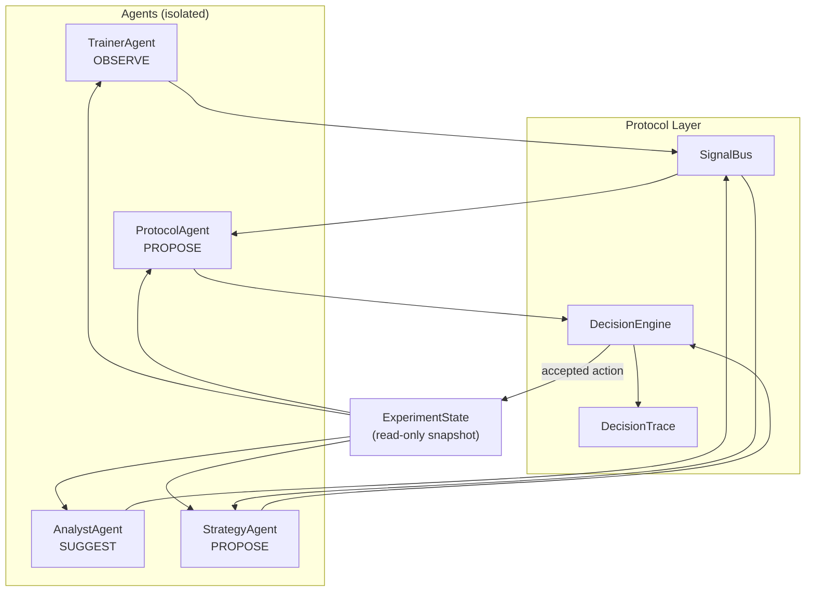

# Agent Protocol Specification v1

**Research Agent Intelligence Layer**

> Formal protocol for multi-agent coordination in automated ML experiments.

---

## 1. Scope

### Defines
- Agent interaction format
- Message/Signal types
- Decision contracts
- Authority limits
- Explainability requirements
- Safety guardrails
- Orchestration model

### Out of Scope
- LLM prompts (internal to agent)
- Agent algorithms (internal)
- Kernel execution DAG (lower layer)

---

## 2. Architectural Model



### Invariants

| Rule | Enforcement |
|:---|:---|
| Agent → Agent direct call | ❌ **FORBIDDEN** |
| Agent → Mutate kernel state | ❌ **FORBIDDEN** |
| Agent → Run skills | ❌ **FORBIDDEN** |
| Agent → `emit_signal()` | ✅ Via `SignalBus` |
| Agent → `propose_decision()` | ✅ Via `DecisionProposal` |
| Agent → Read state | ✅ Read-only snapshot |

---

## 3. Agent Role Model

Every agent declares an `AgentDescriptor`:

```yaml
AgentDescriptor:
  name: str                    # unique agent name
  role: AgentRole              # trainer|analyst|protocol|strategy
  inputs: List[SignalType]     # signal types consumed
  outputs: List[ActionType]    # decision types produced
  authority_level: AuthorityLevel
  risk_level: RiskLevel
  version: str
```

### Authority Levels

| Level | Permission | Example |
|:---|:---|:---|
| `OBSERVE` | Read-only analysis | TrainerAgent |
| `SUGGEST` | Soft recommendations (no actions) | AnalystAgent |
| `PROPOSE` | Structured `DecisionProposal` | ProtocolAgent, StrategyAgent |
| `VETO` | Emergency stop (guarded) | Reserved |

---

## 4. Canonical Agents v1

### 🎓 TrainerAgent
| | |
|:---|:---|
| **Role** | Execution observer |
| **Inputs** | `trial_results`, `training_metrics`, `resource_usage` |
| **Outputs** | `training_summary`, `instability_signal` |
| **Authority** | `OBSERVE` |

### 📊 AnalystAgent
| | |
|:---|:---|
| **Role** | Metric reasoning |
| **Inputs** | `metric_history`, `variance`, `slopes` |
| **Outputs** | `plateau_signal`, `divergence_signal`, `confidence_estimate` |
| **Authority** | `SUGGEST` |

### 🧪 ProtocolAgent
| | |
|:---|:---|
| **Role** | Method strategy |
| **Inputs** | `dataset_profile`, `trial_distribution`, `budget_state` |
| **Outputs** | `protocol_proposal`, `hpo_method_proposal` |
| **Authority** | `PROPOSE` |

### 🧠 StrategyAgent
| | |
|:---|:---|
| **Role** | Meta control |
| **Inputs** | `all_signals`, `pattern_matches`, `agent_proposals` |
| **Outputs** | `plan_update`, `search_mutation_proposal`, `stop_proposal` |
| **Authority** | `PROPOSE` (bounded) |

---

## 5. Signal Protocol

Agents communicate **only** through typed signals on a shared `SignalBus`.

```yaml
Signal:
  type: SignalType        # enum, see below
  source: str             # emitting agent name
  timestamp: float        # epoch
  payload: Dict[str, Any] # signal-specific data
  confidence: float       # 0.0 - 1.0
```

### Standard Signals v1

| Signal | Emitter | Meaning |
|:---|:---|:---|
| `metric_plateau` | Analyst | Loss slope below threshold |
| `metric_divergence` | Analyst | 3+ consecutive rising losses |
| `high_variance` | Analyst | CV > 0.3 across trials |
| `budget_low` | Strategy | Budget utilization > 80% |
| `search_flat` | Mutator | Search space landscape is flat |
| `drift_detected` | OnlineLearner | Concept drift (CUSUM) |
| `mutation_applied` | Mutator | Search space was mutated |
| `trial_completed` | Trainer | Trial finished |
| `trial_failed` | Trainer | Trial crashed |
| `instability` | Trainer | Training instability |

---

## 6. Decision Proposal Protocol

Agents **DO NOT** make decisions. They produce `DecisionProposal`s.

```yaml
DecisionProposal:
  id: str               # auto-generated UUID
  agent: str            # proposing agent name
  action_type: ActionType
  target: str           # what to act on
  parameters: dict      # action parameters
  expected_effect: str   # what should happen (§9)
  risk_level: RiskLevel  # low|medium|high|critical
  confidence: float      # 0.0 - 1.0 (§9)
  rationale: str         # WHY (§9, MANDATORY)
  signals_used: List[str] # which signals informed this
```

### Action Types

| Action | Risk | Description |
|:---|:---|:---|
| `SWITCH_HPO` | Low-Med | Change HPO strategy |
| `MUTATE_SEARCH` | Low | Apply search space mutation |
| `STOP_EXPERIMENT` | High | Terminate experiment |
| `EXTEND_TRIALS` | Medium | Add more trials |
| `CHANGE_PROTOCOL` | Medium | Switch research protocol |
| `ENABLE_CURRICULUM` | Medium | Enable curriculum learning |
| `RUN_ENSEMBLE` | Medium | Switch to ensemble protocol |
| `CONTINUE` | Low | No change needed |

---

## 7. Decision Fusion Layer

`DecisionEngine` is the **sole arbiter**. Pipeline:

```
  collect proposals
       │
  filter by authority (§3)
       │
  check explainability (§9)
       │
  check guardrails (§8)
       │
  resolve conflicts
       │
  score: role_priority × confidence
       │
  accept or reject
       │
  log DecisionTrace (§10)
```

### Conflict Resolution

```
priority(STRATEGY) = 4  >  priority(PROTOCOL) = 3
priority(ANALYST) = 2   >  priority(TRAINER) = 1

score = role_priority × confidence
highest score wins
```

> **Exception**: HIGH risk proposals with `confidence < 0.8` are auto-rejected regardless of priority.

---

## 8. Guardrail Contract

Every proposal passes through guardrails before acceptance:

| Guard | Rule | Blocks |
|:---|:---|:---|
| **Budget** | Cannot exceed `remaining_budget` | `EXTEND_TRIALS` when budget ≥ limit |
| **Mutation** | shrink ≤ `max_shrink%`, diversity ≥ `min_diversity` | Excessive search mutations |
| **Stability** | No protocol switch during active trial | `SWITCH_HPO`, `CHANGE_PROTOCOL` mid-trial |
| **Risk-Confidence** | HIGH risk needs confidence ≥ 0.8 | Unsafe stops/resets |
| **Loop** | Max cycles enforced by LoopController | Infinite adaptive loops |
| **CL Cooldown** | `cooldown_window` + `max_retrain_frequency` | Drift → retrain storm |

---

## 9. Explainability Requirement

**Every proposal MUST contain:**

| Field | Required | Auto-reject if |
|:---|:---|:---|
| `rationale` | ✅ | Empty string |
| `signals_used` | ✅ | (warning only) |
| `expected_effect` | ✅ | (warning only) |
| `confidence` | ✅ | Below `min_confidence` |

> Proposals without rationale are rejected at validation time (Pydantic validator).

---

## 10. Decision Trace Spec

Every decision cycle produces a `DecisionTrace`:

```yaml
DecisionTrace:
  decision_id: str
  timestamp: float
  proposals_considered: List[DecisionProposal]
  chosen: Optional[DecisionProposal]
  rejected: List[{proposal_id, reason, outcome}]
  guardrail_checks: List[str]
  final_parameters: Dict
```

**Used for:** audit, replay, paper writer, debugging.

---

## 11. LLM Usage Contract

If an agent uses an LLM internally:

| MUST | MUST NOT |
|:---|:---|
| Bounded output schema | Free-form execution commands |
| Pydantic validator | Skill invocation |
| Fallback rule engine | Kernel state mutation |
| Confidence score | Direct agent-to-agent calls |

---

## 12. Failure Protocol

```
Agent crashes → mark DEGRADED → fallback to rule policy → continue experiment
```

**Meta-layer MUST NOT break execution layer.**

Agent statuses: `ACTIVE` → `DEGRADED` → `FAILED`

---

## 13. Extensibility Contract

New agents MUST:
1. Declare `AgentDescriptor` with inputs/outputs
2. Implement `ProtocolAgent.process(state, signals) → (signals, proposals)`
3. Never reference other agents directly
4. Pass all §14 compliance tests

---

## 14. Compliance Tests

Every agent passes:

| Test | Validates |
|:---|:---|
| **Deterministic mode** | Fresh instance + same input → same output |
| **Schema validation** | Valid `AgentDescriptor`, typed outputs |
| **Guardrail rejection** | DecisionEngine blocks unauthorized/unsafe proposals |
| **Explainability** | All proposals have rationale + confidence > 0 |

Implementation: [test_agent_protocol.py](file:///C:/Users/macht/SA/sgr_kernel/tests/test_agent_protocol.py)

Protocol layer: [agent_protocol.py](file:///C:/Users/macht/SA/sgr_kernel/skills/lora_trainer/agent_protocol.py)
