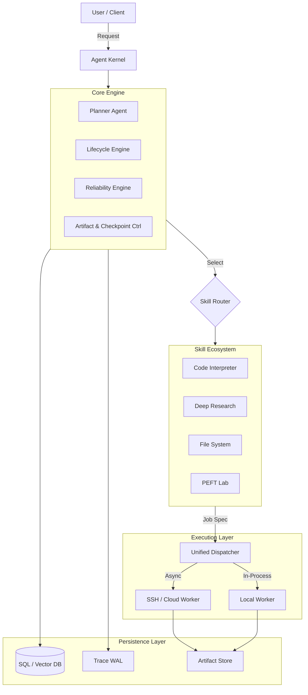
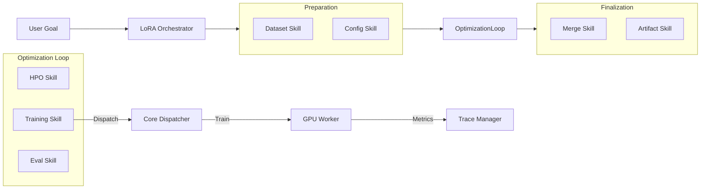

# Architecture

## High-Level Agent Architecture



## PEFT Lab Skill Stack (LoRA Trainer)

Detailed view of the `lora_trainer` subsystem.




## ASCII: LoRA / PEFT Research Flow

```text
experiment.yaml
     │
     ▼
dataset_skill.analyze
     │
     ▼
config_skill.build_search_space
     │
     ▼
FOR trial in search_space:
    │
    ├── training_skill.run
    │       │
    │       ▼
    │   adapter checkpoint
    │
    ├── eval_skill.run
    │       │
    │       ▼
    │   metrics.json
    │
    └── artifact_skill.store

     │
     ▼
hpo_skill.select_best
     │
     ▼
merge_skill (optional)
     │
     ▼
report + manifest + reproducibility verify
```

---

# Архитектура (Architecture)

## Высокоуровневая Архитектура Агента

*   **Core Engine**: Мозг. Планирует, контролирует жизненный цикл и надежность.
*   **Skill Router**: Маршрутизатор. Выбирает нужный инструмент (Capability-aware).
*   **Skills**: Инструменты (Код, Ресерч, ML).
*   **Dispatcher**: Транспорт. Отправляет задачи на Local/SSH/Cloud.
*   **Execution Layer**: Воркеры, где происходит реальная работа.
*   **Persistence**: База знаний и логов. БД, Трейсы, Артефакты.

## Стек PEFT Lab (LoRA Trainer)

Детальный вид подсистемы `lora_trainer`.
*   **Orchestrator**: Управляет циклом обучения.
*   **Preparation**: Подготовка данных и конфигов.
*   **Optimization Loop**: Цикл HPO -> Train -> Eval.
*   **Finalization**: Слияние весов (Merge) и экспорт.

